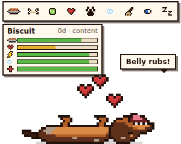

# Desktop Dachshund

An 8-bit chocolate dapple miniature dachshund that lives on your Windows
desktop, Tamagotchi-style. It sits on your taskbar, wanders along it, asks
for food, rolls over for belly rubs, and curls up to sleep.



## Install

Download one of these from the latest build (GitHub → **Actions** → newest
*Test & build* run → **desktop-dachshund-windows**, or from **Releases** once
a version is tagged):

| File | What it is |
| --- | --- |
| `DesktopDachshund-Setup-<version>.exe` | Installer. Adds Start menu + desktop shortcuts, **updates itself**. |
| `DesktopDachshund-<version>-portable.exe` | Single file, no install. Tells you when an update is out. |

The app is not code-signed, so the first time Windows SmartScreen will say
"Windows protected your PC". Click **More info → Run anyway**.

## Updates

The app checks this repo's GitHub Releases 15 seconds after starting and
every 6 hours. You can also right-click → **Check for updates**.

- **Installed copy:** the new version downloads in the background and
  installs the next time the app restarts (or right-click → **Restart to
  update**).
- **Portable copy:** the dog tells you a new version is out, and the menu
  item opens the release page to download it.

Your dog is saved separately from the app, so updating keeps it.

### Publishing a release

1. Bump `version` in `package.json` (e.g. `1.0.2`) and commit.
2. Tag and push: `git tag v1.0.2 && git push origin main v1.0.2`
3. The *Test & build* workflow runs every test on Windows, builds the
   installer and portable exe, and attaches them (plus `latest.yml`, which
   the updater reads) to a GitHub Release for that tag.

The repo must stay public for update checks to work without a token.

## Playing

- **Hover** the dog to see the toolbar and its stats; they tuck away a
  second after the mouse leaves.
- **Click** the dog for a belly rub. **Drag** it anywhere.
- **Right-click** the dog (or the tray icon) for the full menu and settings.
- **Click a poop** to clean it up.

| Action | Effect |
| --- | --- |
| Feed | Fullness +35. It will need to poop about 40 minutes later. |
| Treat | Happiness +15. Five a day; more than that is bad for them. |
| Play fetch | Happiness +22, costs energy. Refused when too tired. |
| Belly rub | Happiness +8. |
| Walk | Happiness +18, costs energy, and they do their business outside. |
| Bath | Hygiene back to 100. Dachshunds hate baths (happiness −10). |
| Clean up | Removes poops. Works while asleep. |
| Vet | Health +45 when poorly. A grumpy, pointless trip when healthy. |
| Sleep / wake | Only sleeps when tired. Wake them early and they're grumpy. |

Stats drop slowly over time (fullness about 8 per hour awake). When any need
stays very low, health starts dropping; when everything is looked after,
health recovers. **The dog never dies.** Neglect makes it sick and sad, and
the vet fixes it.

While the app is closed time still passes, but at most 12 hours of it counts,
and no stat drops below 15 from time away. You won't come back from a
weekend to a starving dog. Sleeping or hibernating the PC counts the same way.

### Settings (right-click menu)

- Wander along the taskbar (on by default)
- Always on top
- Sound (little 8-bit blips)
- Notifications (Windows toasts when hungry/sick/lonely, at most once an hour each)
- Start with Windows
- Move back to corner, Rename, Start over

Save data lives in `%APPDATA%\Desktop Dachshund\` (`pet.json`, `settings.json`).

## Development

Requires Node.js 18+.

```bash
npm install
npm start               # run the widget
npm test                # logic + sprite + UI tests (headless Chromium)
npm run test:electron   # end-to-end tests of the real Electron app
npm run dist            # on Windows: build installer + portable exe into dist/
npm run dist:linux      # on Linux with wine64: portable exe
npm run icons           # regenerate assets/ icons from the sprite data
```

On Linux, run the Electron tests under a virtual display:
`xvfb-run -a npm run test:electron`. The UI tests need a Chromium that
matches `playwright-core` (`npx playwright-core install chromium`).

`tools/preview.html` shows every sprite frame side by side; open it in a
browser after editing `src/sprites.js`.

### How it's built

| Path | Purpose |
| --- | --- |
| `main.js` | Electron main process: transparent always-on-top window, tray, menu, saving, window walking/dragging. |
| `preload.js` | The only bridge between the page and the OS (context isolation on, no Node in the page). |
| `renderer/` | The widget page: game loop, drawing, input, HUD. |
| `src/pet.js` | Pure simulation: stats, decay, actions, mood. No DOM, fully unit tested. |
| `src/sprites.js` | All pixel art as ASCII grids, plus the drawing helpers. |
| `test/` | `pet` and `sprites` unit tests, `ui` browser tests, `electron` end-to-end tests. |

The sprites are hand-drawn from photos of the real dog: chocolate base with
silver dapple patches, tan eyebrows, muzzle, chest and legs, long hanging
ears. Transparent pixels are click-through, so the widget never blocks what's
behind it.
